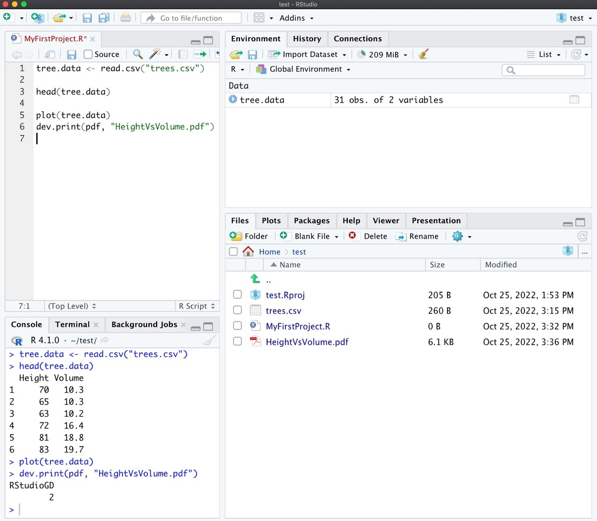

```{r setup, include=FALSE}
knitr::opts_chunk$set(echo = TRUE)
```

```{r klippy, echo=FALSE, include=TRUE}
klippy::klippy(position = c('top', 'right'))
```

# Organize your R-files {.tabset}

## Where do R-files live on your computer?

All code you write in the console will leave its mark in the *workspace*, that is in the *Environment* and *History*-tabs in the top right of your RStudio working environment. Once you have finished your work and you close RStudio, everything you have done will be saved in two files called *.RData* and *.RHistory*. These files are located in your *home directory*. These files are not meant to be opened and read by you. Instead, R uses them to recover your previous work once you open R again.


## R-projects

The best possible way to address all these issues is by working with *Projects* in RStudio. *Projects* is structure that comes with RStudio and that allows you to keep all the files associated with a project organized together -- input data, R scripts, analytical results, figures.

The advantage of working with projects is that the working directory is automatically given by the project folder and all path are *relative* to that folder.

Let's put some life into these abstract ideas by creating a project. You can do this by choosing *New Project* from the *File*-Menu in RStudio. Choose *New Directory* from the pop-up menu, then choose *New Project* at the next step and give it a name. The directory name you choose here will be the project name. Call it whatever you like (but keep in mind that good names are short and informative). Finally, choose a location for you project. You might want to have one location for all R-projects you work on. Alternatively, you might want to place directory in a folder where you have things related to the current course.

In the bottom-right window you will now see in the file tab a new file called *YourFileName.Rproj*. Next let us add an R-script to this project and immediately safe it (for this you will have to name it). It will then appear in the file tab in the bottom right of your RStudio window.

Download the following data file that contains two different measurements about trees to your computer.

```{r, echo=FALSE}
(xfun::embed_file("trees.csv"))
```

Save this file to your project folder. You should now see the file *trees.csv* in the files-tap at the bottom-right of your RStudio window.

Next, load the data into your workspace using the command

```{r}
tree.data <- read.csv("trees.csv")
```

You might want to have a look at the data:

```{r}
head(tree.data)
```

Finally, let us plot volume of trees as a function of their height and export the resulting graph as a pdf.

```{r}
plot(tree.data)
dev.print(pdf, "HeightVsVolume.pdf")
```

This will add a new file called *HeightVsVolume.pdf* to your project folder. Your RStudio environment should now look something like this:

```{r, echo=FALSE}

```

The key point is that all you files (data, R-script, graphics output) related to this exercise are stored in the same project folder. **Notice that at no point when loading or saving data did you have to specify a *path* **. The reason is that when working with a *Project* the *working directory* is automatically set to the project folder.

You can now save your R-script and close RStudio. If you want to continue to work on this project at a later time, you can open RStudio and choose the desired project by selecting it from *Recent Projects* under the *File*-menu or by simply opening the *.Rproj*-file from whereever you have stored it.

### Further Information

I am not sure I managed to convince you that working with *Projects* is the way to go. In case I didn't, I suggest you to believe me for the moment that this is indeed the *best practice*. The real utility of this will become more apparent once you work with larger projects that include lots of data files and as you collaborate with others or want to share your work in a manner so that your analysis is *reproducible* by others. I recommend the following source if you want to dig just a little bit deeper into this topic.

* RStudio provides more detailed instructions on how to use projects, which you can find [here](https://support.rstudio.com/hc/en-us/articles/200526207-Using-Projects).

* [This](https://www.r-bloggers.com/2020/01/rstudio-projects-and-working-directories-a-beginners-guide/) blogpost explains in more detail why working with projects is the right thing to do.
