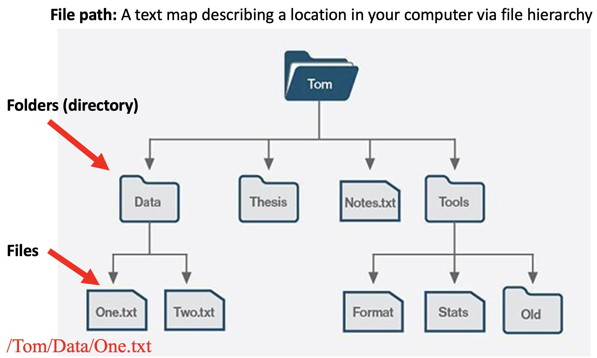
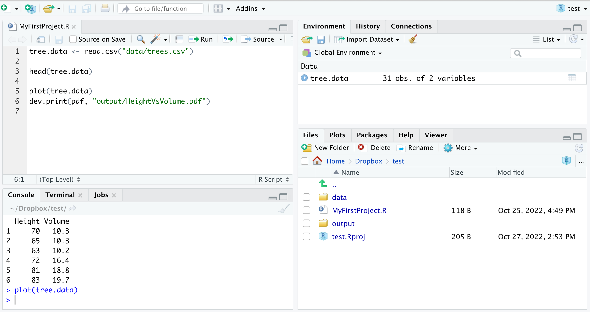

```{r setup, include=FALSE}
knitr::opts_chunk$set(echo = TRUE)
```

```{r klippy, echo=FALSE, include=TRUE}
klippy::klippy(position = c('top', 'right'))
```

# Organize your *R*-files {.tabset}

## Where do *R*-files live on your computer?

We started our *tour-de-R* by writing code into the **console**. Everything you write in the console will leave its mark in the *work space*, that is, in the *Environment* and *History*-tabs in the top right of your RStudio working environment. Once you are done with your work and you close RStudio, everything is saved in two files called *.RData* and *.RHistory*. These files are located in your *home directory*, but they are not meant to be opened and read by you. Instead, *R* uses them to recover your previous work session once you open RStudio again.

We then started to work with **R-scripts**. *R*-scripts allow you to more easily re-run and augment earlier analyses and enables you to work on different analyses in parallel by storing the corresponding code in separate *R*-scripts. 

*R*-scripts are files ending on *.R* that are saved on our computer. We can then share them with colleagues when we collaborate on an analyses or make them publicly available so that people interested in our work can *reproduce* our results.

#### *R*-scripts involving external data

Whenever we work with data, we have to import these from other files (often these will be *comma-separated-value*-files, that is, *.CSV* files). Let's do an example. For this, download the file *trees.csv* to your computer by clicking on the following link:

```{r, echo=FALSE}
(xfun::embed_file("data/trees.csv"))
```

This file contains two different measurements from trees, namely, their height and volume. It seems reasonable to assume that height and volume are positively correlated and an obvious first step to investigate this hypotheses is to plot volume as a function of height. In order to be able to do this, you first have to read the data into your workspace, for instance, using the command `read.csv()`.

There are two straight-forward ways of doing this involving the *absolute path* to the file on your computer. This figure illustrates the logic the hierarchical file structure on a computer and how the file path results from it.

```{r, echo=FALSE}

```

First, you can either add the *absolute* path in front of the file name within the `read.csv()` command. On my computer, this would currently be 

```{r}
tree.data <- read.csv("/Users/ClausR/Documents/github websites/CodingWithR/trees.csv")
```
<!-- if I compile this on my laptop the path is: /Users/clausruffler/Documents/github websites/CodingWithR/trees.csv -->
<!-- if I compile this on my desktop the path is: /Users/ClausR/Documents/github websites/CodingWithR/trees.csv -->
<!-- note that there is a second instance of this a few lines further down -->

Now we are ready to inspect the data.

```{r}
head(tree.data)
```

Second, you set the *working directory* to be equal to the location of file *trees.csv* on your computer. The working directory is a file path on your computer that sets the default location of any files you read into *R*, or save out of *R*. You can only have one working directory active at any given time. This active working directory is called  your *current* working directory and you can find it using

```{r, eval=FALSE}
getwd()
```

and set the working directory to any other location using the command `setwd()`. For example, let me set my working directory to be the location of the file *tress.csv* on my computer.

```{r}
setwd("/Users/ClausR/Documents/github websites/CodingWithR")

getwd() # check that the above code did the job
```

With this change of working directory, I can now import the file *trees.csv* by using `read.csv()` without adding a file path.

```{r}
tree.data.2 <- read.csv("trees.csv")
head(tree.data.2)
```

These approaches, although a bit cumbersome, work just fine. The problem, however, is that this *R*-script will almost certainly not work on your next computer, or, for the same matter, on anybody else's computer, simply because there are no two computers with exactly the same file structure. Luckily, there is an easy method with which we will never have to bother about *absolute* file paths. In RStudio, this is called **Projects** and we explore them in the next tab.

## *R*-projects

The best possible way to address the difficulties arising from using absolute file paths is by working with *Projects* in RStudio. A *Project* is a file structure that comes with RStudio and that helps you to keep all files associated with a specific project organized in a common folder -- input data, *R* scripts, analytical results, figures.

The advantage of working with projects is that the working directory is automatically given by the project folder and all paths to files are *relative* to that folder (what is meant with this hopefully becomes clear further down).

Let's put some life into these abstract ideas by creating a project. You can do this by choosing *New Project* from the *File*-Menu in RStudio. Choose *New Directory* from the pop-up menu, then choose *New Project* at the next step and give it a name. The directory name you choose here will be the project name. Call it whatever you like (but keep in mind that good names are short and informative). Finally, choose a location for you project. You might want to have one location for all R-projects you work on. Alternatively, you might want to place the directory in a folder where you have all things related to the current course.

In the bottom-right window you will now see in the file tab a new file called *YourFileName.Rproj*. Next, let us add an *R*-script to this project and immediately safe it (for this you will have to name it). It will then appear in the file tab in the bottom right of your RStudio window.

Let's further populate our new project by adding the tree data file our project.

```{r, echo=FALSE}
(xfun::embed_file("data/trees.csv"))
```
\ <!--this lonely slash inserts an empty line-->

Manually move this file to your project folder. You should now see the file *trees.csv* in the files-tap at the bottom-right of your RStudio window. It is good habit to organise the files in a project into folders, each of them storing files of a certain type. Thus, let us move the file *trees.csv* to a new folder called *data* (use the *add folder*-icon in the file-tab to create this new folder and then move the data file to it by first ticking the box in front and then choosing *Move* under *gear wheel*-icon).

Next, go back to your *R*-script and load the data into your work space using the command

```{r}
tree.data <- read.csv("data/trees.csv")
```

Note that in this code, *data/trees.csv* indicates the *path* to the data file *within* the project folder. In other words, the path is *relative* with respect to the project folder. The beauty is that this code to load the data file should now work on each and everybody's computer that contains the project folder!

Finally, let's plot the volume of trees as a function of height and export the resulting graph as a pdf.
Again, let us keep a clear structure in our project folder by keeping files of different types in different folders. Thus, before you run the following code create a new folder called *images*.

```{r}
plot(tree.data)
dev.print(pdf, "images/HeightVsVolume.pdf")
```

In this code, *images/HeightVsVolume.pdf* is the complete path, relative to the project folder, to the location to which we store the newly created pdf.

Your RStudio environment should now look something like this:

```{r, echo=FALSE}

```

The key point is that all your files (data, *R*-script, graphics output) related to this exercise are stored in the same project folder. **In particular, notice that each time you loaded or saved data, you had to specify the file *path* only relative to the project folder**. The reason is that when working with a *Project* the *working directory* is automatically set to the project folder. It is exactly this feature that allows to re-run your code on whatever computer, that is, by another person or by you -- years later -- when you have a different computer. Your work becomes fully **reproducible**!

You can now save your *R*-script and close RStudio. If you want to continue to work on this project at a later time, open RStudio and choose the desired project by selecting it from *Recent Projects* under the *File*-menu or simply navigate to the *.Rproj*-file on your computer and open it.

### Further Information

Hopefully I managed to convince you that working with *Projects* is the way to go. The real utility of this will become more apparent once you work with larger projects that include lots of data files and as you collaborate with others or want to share your work in a manner so that your analysis is *reproducible* by others. I recommend the following sources if you want to dig just a little bit deeper into this topic.

* RStudio provides more detailed instructions on how to use projects, which you can find [here](https://support.rstudio.com/hc/en-us/articles/200526207-Using-Projects).

* [This](https://www.r-bloggers.com/2020/01/rstudio-projects-and-working-directories-a-beginners-guide/) blogpost explains in more detail why working with projects is the right thing to do.
