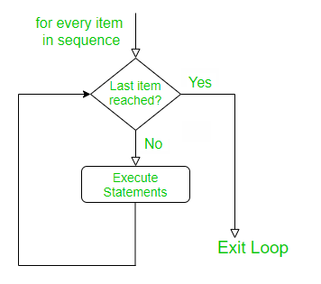

```{r setup, include=FALSE}
knitr::opts_chunk$set(echo = TRUE)
```

<!--
```{r klippy, echo=FALSE, include=TRUE}
klippy::klippy(position = c('top', 'right'))
```
-->

# Programming in R {.tabset}

<!--## Computing Using Scripts

Now that we are more familiar with the basics of *R*, we turn to writing *programs*.
Typically, you will write more complex programs in a text file (called a script), with extension ```.R```. Before writing our first programs, this section will demonstrate how to organize your code to make it readable and easy to understand.-->

## Writing Good Code

Before writing scripts, here a few suggestions on how to organize and format your code:

##### Names

Use *descriptive* and *short* file names for your scripts. Likewise, choose informative names for your objects and functions; use underscore (_) or dots (.) to separate words.

````
# good object names (use nouns!)
my_variance 
radius
body.mass
# bad object names
tmp5
foo
good
````

To avoid confusion, never call your objects

````
I # uppercase i
O # uppercase o
o # lowercase O
l # lowercase L
````

Good function names are informative:

````
calculate_cv
random_time_series
````

Bad (i.e., uninformative) function names are

````
f1
faster_version
this_works_well
````

##### Spacing and Parentheses

Put a space before and after an operator (the only exception is a colon), and before a left parenthesis (function arguments are the only exception). Add a space after each comma, but not before. A white line separates functions. Use parentheses to make complex calculations easier to understand.

```{r eval=FALSE}
# good
x <- 5 * 7
y <- 7 * (x ^ 2)
m <- matrix(25, 5, 5)
z <- mean(x, na.rm == TRUE)
i <- t + 1
z <- (x * y) + (x2 * y2)

if (b == 5) {
  do(something)
} else {
  do(something_else)
}

# bad
x<-5*7 # hard to read
y <- 7*x^2
m <- matrix(25 , 5 , 5) # m is not very informative
```

## Loops

An important way modify the flow of a program is to write a loop. A loop is a series of commands that are repeated a number of times. For example, you want you want to interate the same calculation many times to produce a population dynamical time series, or you want to run the same analysis on different data sets that you have collected, etc.

R provides you with two ways to loop over blocks of commands: the ```for``` loop, and the ```while```-loop. Let’s start with the ```for```-loop, which is used to **iterate over a vector (or a list): for each value of the vector, a series of commands will be run.

#### *for*-loops

The the anatomy of a *for*-loop is:

````
for (variable in list_or_vector) {
  execute these commands # if there is more than one command each has to start on a new line
}
````
Here a simple example.

```{r eval=FALSE}
myvec <- 1:10 # vector with numbers from 1 to 10
for (i in myvec) {
  a <- i ^ 2
  print(a)
}
```

In the code above, the variable *i* takes the value of each element of *myvec* in sequence. Inside the block defined by the for-loop, you can use the variable *i* to perform operations. Note that *i* is only an example of a variable name. Note also that in this for-loop each new command starts on a new line. This is essential! The same applies to the other looping constructions and to functions.

We can visualize to the logic of the *for*-loop using a flow chart.

```{r echo=FALSE, out.width = '30%'}

```

As a slightly less trivial example, let us calculate the factorials of *n*, $n! = 1 * 2 * ... * (n-1) * n$ using a for-loop.

```{r}
result <- 1
for(i in 1:6) {
  result <- result * i
  print(result)
}
```

Let us come to ecology and use the *for*-loop to compute the time series of an exponentially growing population.

```{r eval=FALSE}
lambda <- 1.1 # the assumed value for lambda
tmax <- 15 # length of the time series
N0 <- 10 # initial population size
n <- c() # creates an empty vector in which we can store the data of the time series
n[1] <- N0 # stores the initial population size as the first entry of the vector n 
for(t in 1:tmax) {
  n[t+1] <- n[t] * lambda
}
n
plot(n)
```

Note that the vector in the *for*-loop need not to be a vector of the first *n* natural number.

```{r}
for (i in seq(2, 5, 0.5))
{
    print(i)
}
```

In summary, a for-loop is used when you know that you want to perform the analysis using a given set of values (e.g., run over for a fixed number of iterations).

#### *while*-loops

The *while*-loop is used when the commands need to be repeated while a certain condition is true. The anatomy of the *while*-loop is

````
while (test expression is TRUE) {
  execute these commands and update the test expression (body of the while loop)
}
````

We can visualize to the logic of the *while*-loop with the following flow chart.

```{r echo=FALSE, out.width = '30%'}
knitr::include_graphics("images/WhileLoop.png")
```

For example,

```{r eval=FALSE}
result <- 1
i <- 1
while(i <= 6) {
  result <- result * i
  print(result)
  i <- i + 1
}
```

This script performs exactly the same operations we wrote with the *for*-loop above. But the *while*-loop is moe complicated. First, we have *initialize* the value *i* outside of the *while*-loop. Second, we have to *update* the value of *i* inside the *while*-loop. What would happen if the last step would be omitted? The loop would run forever (infinite loop — to terminate click on the "Stop" button in the top-right corner of *RStudio*). Thus, programming with *while*-loops is more error-prone and, if possible, one should use a *for* loop instead.

But first, lets get some practice with the *while*-loop.

##### Exercises

a) Write a *while*-loops that produces exactly the same population dynamical time series as above.

```{r eval=FALSE, echo=FALSE}
lambda <- 0.9
n <- c()
N0 <- 5
n[1] <- N0
tmax <- 15
t <- 1
while (t <= tmax) {
  n[t + 1] <- n[t] * lambda
  t <- t + 1
}
n
```

b) Assume $\lambda < 1$. In this case, the population will shrink should ultimately go extinct. Let us a define a population as extinct whenever the population size has dropped below 1. Write a *while*-loop that runs exactly as long as it takes for the population to go extinct (hint: you have to use the extinction condition as the text-expression in the *while* loop). What is the easiest way to determine how long it takes for the population to go extinct?

```{r eval=FALSE, echo=FALSE}
lambda <- 0.9
n <- c()
N0 <- 5
n[1] <- N0
t <- 1
while (n[t] > 1) {
  n[t + 1] <- n[t] * lambda
  t <- t + 1
}
```

c) What does this code do? Try to understand what the loop does, and then create and run a script to confirm your intuition.

```{r eval=FALSE}
z <- seq(1, 100, by = 3)
for (k in z) {
   if (k / 4 < 10) {
    print(k)
  }
}
```
\
### *if*-statements

Not a loop but another important way to modify the flow of your program: *ifelse*-constructs allows us to make the execution of commands conditional. The function ```ifelse(test, yes, no)``` contains a logical *test*, and *yes* and *no* are output conditional of whether the logical test results in *TRUE* or *FALSE*.

```{r eval=FALSE}
x <- 2
ifelse (x > 0, "positive", "negative or 0")
```

If we want to incorporate more than one logical test we can use ```if``` and ```else``` as in the following example:

```{r eval=FALSE}
x <- 0
if (x < 0) {print("Negative number")} else
    if (x > 0) {print("Positive number")} else
      print("Zero")
```

We can achieve the same result by nesting the ```ifelse``` command but this can become a bit hard to read if done repeatedly.

```{r eval=FALSE}
x <- 2
ifelse (x > 0, "positive", ifelse(x < 0, "negative", "zero"))
```
\

## Functions

So far, we have used many built-in functions (e.g., ```length```, ```dim```, ```log```, ```sum```, etc.). What makes R powerful is the ability to define your own functions and invoke them within your programs. These are called *user-defined functions*.

Here is the general anatomy of a function:

````
my_func_name <- function([optional arguments]) {
  operations
  return(value) [optional]
}
````

For instance,

```{r}
circle.area <- function(radius) {
  pi * radius^2
}
```

defines a function called ```circle.area``` which takes as input argument a variable called *radius*  and returns the value *pi*radius^2* (here *pi* is the constant $\pi=3.14\ldots$), which is indeed the formula for the surface area of a surface. The code of the function is contained between the curly brackets. At the end, a value may be returned.

After submitting the function to *R*, we can *call* this function to calculate the surface of circles with given radius.


```{r eval=FALSE}
circle.area(2)
# apply the function to a vector of radii
circle.area(1:5) # We can apply the function to the numbers 1 to 5 in a single step; thus, we apply functions to a vector.
```

Some functions may have more than one argument and may return more than one value:

```{r eval=FALSE}
rectangle <- function(side_1, side_2){
  circumference <- 2 * side_1 + 2 * side_2
  surface <- side_1 * side_2
  return(list(circumference = circumference, surface = surface))
}

rectangle(2, 3)
```

Here, the output of the function is presented in a named list.

It is often useful to explore functions by plotting them (see next section):

```{r}
curve(circle.area(x), from = 0, to = 2, xlab = "radius",  ylab = "circle area")
```

Exercise: Plot the area of a rectangle with as a function of *side_1* (with *side_1* between 0 and 2) given that *side_2=2*.

```{r, echo=FALSE, eval=FALSE}
curve(rectangle(x, side_2 = 2)$surface, from = 0, to = 2, xlab = "side_1", ylab = "rectangle surface")
```

Functions can be arbitrarily complicated and most simulation models will have a more or less complex function at its heart. For instance, we can incorporate loops and ```iflese```-constructs into functions.

```{r eval=FALSE}
sign_of_a_number <- function(x){
  if (x < 0) {print("Negative number")} else
    if (x > 0) {print("Positive number")} else
      print("Zero")
}

sign_of_a_number(2.3)
```

To calculate the factorial more easily we can wrap a function around the while loop from the previous section:

```{r eval=FALSE}
my.factorial <- function(n){
  result <- 1
  i <- 1
  while (i <=  n){
    result <- result * i
    i <- i + 1
  }
  result
}

my.factorial(4)
```

Let us code a function that produces a population dynamical time series for exponential growth in discrete time.

```{r}
time.series <- function(tmax, lambda, N0){
  n <- c(N0) # creates a vector with the initial population size N0 in its first position
  for (t in 1:tmax) {
    n[t+1] <- n[t] * lambda
  }
  return(n)
}

time.series(tmax = 20, lambda = 1.1, N0 = 10)
```

So far, so good. How can we plot the time series? Simply writing ```plot(n)``` does not work because the vector *n* in which the time series is stored is stored only *locally*, that is, within the function *time.series* (the output does not appear in your environment tab). But it is easy to export the values in *n* from the function by assigning the output of the function to a new object, which we here again call *n*.

```{r}
n <- time.series(tmax = 20, lambda = 1.1, N0 = 10) # we assign the output of the function to n. It is only now that n appears in your environment tab and we can now use it outside the function.
plot(n)
```

The take-home message from this last step is important! Objects are *local* when they are declared *inside* a function. In this case, they are accessible only inside the function (and they do not appear in the *Environment*-tab). In contrast, *global* variables are those assigned outside a function, they appear in in the *Environment*-tab and are accessible everywere in *R*. Here a minimal example illustrating these ideas.

```{r}
square <- function(x) {
  result <- x^2
}

square(3)
result # this will produce the Error: object 'result' not found

result <- square(3)
result # this will show that the result is equal to 9
```

 
## Random Numbers

*R* can sample (pseudo)random numbers from many distributions. This is very useful for *stochastic* simulations.

Important *discrete* probability distributions are the [*Binomial distribution*](https://en.wikipedia.org/wiki/Binomial_distribution) and the [*Poisson distribution*](https://en.wikipedia.org/wiki/Poisson_distribution). 

The binomial distribution is used to model any process that we could envisage as a repeated and weighted coin flip. Assume, for example, that a population consists of *size=100* individuals and that each individual dies with probability *p=0.3* from one time step to the next. The outcome of a single experiment, describing the number of surviving individuals, can then be modeled using

```{r eval=FALSE}
# draws one value of a random variable from binomial distribution with parameters size=100 and p=0.7=1-0.3
rbinom(n = 1, size = 100, p = 1-0.3)
```

In population ecology, it is often assumed that the number of offspring per female is Poisson distributed with a mean value given by the parameter $\lambda$. For example, if on average each female has $\lambda=2$ offspring, then the stochastic realization of this process can be modeled using

```{r eval=FALSE}
# draws five values of a random variable that is Poisson distributed with a mean given by lambda = 2
rpois(5, lambda = 2)
```

<!--
Another important discrete distribution is the [*binomial distribution*](https://en.wikipedia.org/wiki/Binomial_distribution).
The binomial distribution is slightly more complicated. It
describes the number of successes in a sequence of *n* independent trials, each asking a yes–no question, and each with its own Boolean-valued outcome: success (with probability p) or failure (with probability *q = 1 − p*). 

```{r}
rbinom(n = 1, size = 1, prob = 0.5) # samples one value
rbinom(n = 1, size = 5, prob = 0.5)
```
-->

Important *continuous* probability distributions are the [*uniform distribution*](https://en.wikipedia.org/wiki/Continuous_uniform_distribution) and [*normal distribution*](https://en.wikipedia.org/wiki/Normal_distribution).

```{r eval=FALSE}
# draws three values of a random variable that is uniformly distributed over the interval (0, 1)
runif(3)
# draws ten values from uniform distribution over the interval (-1, 1)
runif(10, -1, 1)
# draws four values from normal distribution with mean 1 and standard deviation 5
rnorm(4, mean = 1, sd = 5)
```

You can also define your *own* probability distribution and then draw values from is using the function

```
sample(x, size, prob, replace, ...)
```

To get to know this function, let us simulate the outcome of throwing a dice. The possible outcomes of throwing a dice are the numbers 1 to 6. This we encode in a vector of possible outcomes: ```possible_outcomes <- c(1, 2, 3, 4, 5, 6)```, or, for short, ```possible_outcomes <- 1:6```. If the dice is *fair* each number occurs with probability 1/6. This we encode in the vector ```probabilities <- c(1/6, 1/6, 1/6, 1/6, 1/6, 1/6)```, or, for short, ```probabilities <- rep(1/6, 6)```. Since the outcome of any particular throw is independent of all previous throws we *sample with replacement*. We have to specify this in the function *sample* by adding *replace = TRUE*. Finally, we have to add how often we throw the dice by specifying a value for *size*, for example, *size = 1* if we throw the dice only once.

```{r eval=FALSE}
possible_outcomes <- 1:6
probabilities <- rep(1/6, 6)

sample(x = possible_outcomes, size = 1, prob = probabilities, replace = TRUE)

sample(possible_outcomes, 10, probabilities, replace = TRUE) # simulating the outcome of ten throws
```

We can use the function ```sample``` to program the binomial distribution ourselves.
The outcome of single a *coin-toss*, for example, to determine in a simulation whether an individual dies from one time step to the next can be programmed as

```{r eval=FALSE}
prob.death <- 0.3
sample(c(0, 1), 1, c(prob.death, 1 -prob.death), replace = TRUE) # returns a 0 if the individuals dies and a 1 if the individual survives where death occurs with probability 0.2
```

We obtain the number of survivors in a population of 100 individuals by repeating this experiment 100 times and sum over the outcome:

```{r eval=FALSE}
prob.death <- 0.3
sum(sample(c(0, 1), 100, c(prob.death, 1 -prob.death), replace = TRUE))
```

#### Exercises

(a) Code a function that simulates the sum of the eyes when throwing two dice together.

```{r eval=FALSE, echo=FALSE}
two_dice_sum <- function() {
  outcome <- sample(x = possible_outcomes, size = 2, prob = probabilities <- rep(1/6, 6), replace = TRUE)
  sum(outcome)
}

two_dice_sum()
```

(b) Code a function that gives the frequency for the different outcomes of throwing a dice as a function of *size*, that is, the number of times a dice is thrown. Present the results in a histogram. How do the results change if you increase *size*?

```{r eval=FALSE, echo=FALSE}
freq_dice <- function(n) {
  out <- sample(x = 1:6, size = n, prob = probabilities <- rep(1/6, 6), replace = TRUE)
  c(length(which(out == 1)), length(which(out == 2)), length(which(out == 3)), length(which(out == 4)), length(which(out == 5)), length(which(out == 6)))/n
}

frequencies <- freq_dice(100000)
barplot(frequencies, xlab = "result of a dice throw")
```

(c) Do the same for the sum of the eyes when throwing two dice simultaneously. Thus, here the question is how the distribution of this sum changes when we increase the number of times we throw two dice together?

```{r eval=FALSE, echo=FALSE}
freq_dice_2sum <- function(n) {
  result <- numeric(n)
  for (i in 1:n) {
    result[i] <- sum(sample(x = 1:6, size = 2, prob = rep(1/6, 6), replace = TRUE))
  }
  c(length(which(result == 2)), length(which(result == 3)), length(which(result == 4)), length(which(result == 5)), length(which(result == 6)), length(which(result == 7)), length(which(result == 8)), length(which(result == 9)), length(which(result == 10)), length(which(result == 11)), length(which(result == 12)))/n
}  

frequencies <-freq_dice_2sum(10000)
barplot(frequencies, xlab = "sum of two dice throws")
```